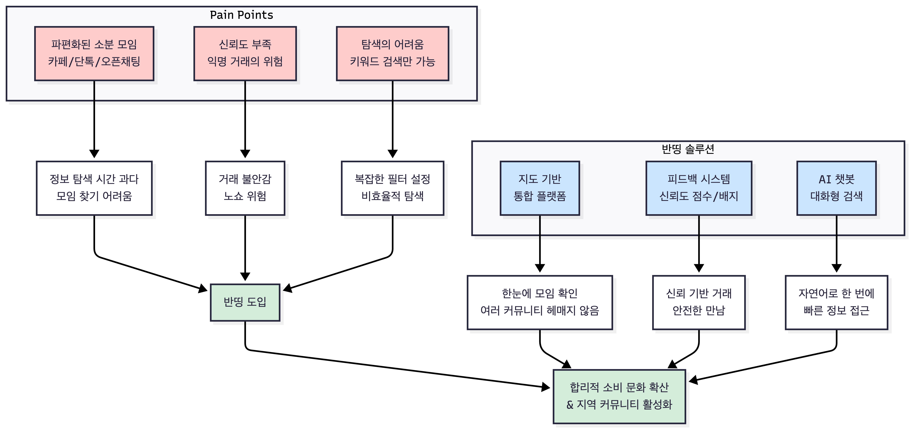

# 프로젝트 개요: 반띵 (BanThing)

## 1. 핵심 요약

**반띵**은 **1-2인 가구**의 합리적 소비를 돕는 **지도 기반 대용량 상품 소분 플랫폼**입니다. 여러 커뮤니티에 흩어진 소분 모임을 **하나의 지도 플랫폼**으로 통합하고, **AI 챗봇 검색**과 **피드백 기반 신뢰도 시스템**으로 안전한 이웃 거래를 지원합니다.

* **개발 기간**: 19일 (기획 7일 + 개발 12일)
* **개발 인원**: 4인 (Full-stack)
* **핵심 가치**: 합리적 소비 문화 확산과 이웃 간 커뮤니티 활성화

---

## 2. 프로젝트 목표 구조

### 2.1. Pain Points와 해결 방안

---

## 3. 프로젝트 만든 배경

### 3.1. 급증하는 1-2인 가구와 대용량 상품의 딜레마

**현상**
- 전체 가구 수에서 1-2인 가구가 1,000만을 돌파 (전체 가구의 약 40%)
- 지속적으로 증가하는 추세

**문제점**
- 창고형 할인매장의 상품들은 여전히 4인 이상 가구를 기준으로 포장
- 1-2인 가구는 합리적인 가격에 좋은 상품을 구매할 기회를 놓치거나, 구매하더라도 다 소비하지 못해 버리는 경우가 많음

**데이터**
- [관련 뉴스: 1인 가구 첫 1000만 돌파](https://www.kmib.co.kr/article/view.asp?arcid=1756284537&code=11131100&cp=nv)
- [관련 뉴스: 대용량 가성비도 버겁다…경기불황·1인가구 증가에 '미니' 경쟁 치열](https://news.nate.com/view/20250523n30462)

### 3.2. 심각해지는 음식물 쓰레기 문제

**현상**
- 하루 평균 1.5만 톤 이상의 막대한 음식물 쓰레기 발생
- 심각한 환경 문제와 연간 수십조 원에 달하는 사회적 비용 유발

**문제점**
- **전체 음식물 쓰레기의 절반 가량이 조리도 되기 전의 식재료 상태에서 버려짐**
- 대용량 상품 구매 후, 다 소비하지 못하고 보관 중에 상해서 버리는 경우가 많음

**데이터**
- [관련 뉴스: 음식물 쓰레기 절반은 '조리 전 쓰레기'...1인 가구 "보관방법 몰라"](https://foodtoday.or.kr/mobile/article.html?no=185242)

### 3.3. 단절된 현대 사회와 커뮤니티의 부재

**현상**
- 도시화가 심화되면서 이웃 간의 교류가 거의 사라짐

**문제점**
- 사회적 고립감 증가
- 위급 상황 발생 시 서로 도울 수 있는 사회적 안전망 약화

**반띵의 역할**
- 공동의 목표(합리적 소비)를 가진 이웃들을 연결
- 자연스러운 만남과 교류의 장을 제공
- 잃어버린 커뮤니티를 활성화하는 데 기여

**데이터**
- [관련 논문: 도시 1인 가구의 지역공동체 경험과 웰빙](https://www.kihasa.re.kr/hswr/v.45/2/422/)

### 3.4. 시장 기회

**창고형 할인점 시장 규모**
- 2024년: 약 9조 900억원
- 2025년 전망: 9조 2,145억원
- 주요 업체: 코스트코, 트레이더스, 롯데마트 맥스

**소비 트렌드**
- '짠테크' 문화 확산 (MZ세대 중심)
- 공유 경제 성장
- 합리적 소비에 대한 니즈 증가

**데이터**
- [관련 기사: 고물가·불황에 더 인산인해…'창고형 할인점' 실적 휘파람](https://www.etoday.co.kr/news/view/2445468)
- [관련 기사: 짠테크 라이프 MZ 소비 패턴이 변하고 있다](https://www.handmk.com/news/articleView.html?idxno=20512)

---

## 4. 기술적 해결방안

| 문제 영역 | 기존 방식 | 반띵 솔루션 | 기술적 구현 |
|:---|:---|:---|:---|
| **정보 탐색** | 파편화된 카페/단톡/오픈채팅 여러 커뮤니티 순회 필요 | 지도 기반 통합 플랫폼 One-View 대시보드 | React + Kakao Map API 마커 클릭 → 모임 리스트 필터링 |
| **신뢰 구축** | 익명 거래 신뢰도 확인 불가 | 피드백 기반 신뢰도 시스템 배지 등급 관리 | Spring Security + JWT trustScore/noShowCount 관리 |
| **참여 관리** | 수동 댓글 확인 수기 인원 관리 | 자동 상태 전환 승인/거절 시스템 | Spring Scheduler PENDING/APPROVED 상태 관리 |
| **모임 검색** | 키워드 검색만 가능 제한적 탐색 | AI 챗봇 자연어 검색 대화형 추천 | Google Gemini API 키워드 추출 + 의도 분류 |

---

## 5. 프로젝트 정보

### 5.1. 기본 정보

**프로젝트 이름**
- **플랫폼명**: 반띵 (BanThing) - *대용량 상품 구매의 부담감을 절반으로 줄이다*

**배포 URL**
- **Frontend**: https://banthing.shop
- **Backend API**: https://api.banthing.shop

### 5.2. 참고 문서

- [**기능 명세서**](03-feature-specification.md) 
- [**아키텍처 설계**](04-architecture.md) 
- [**DB 설계**](05-database-design.md) 
- [**API 설계**](06-api-design.md) 
- [**향후 업데이트 계획**](07-roadmap.md) 
- [**식품안전법**](08-food-safety-law.md) 

