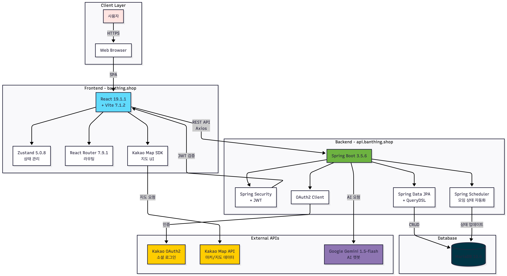
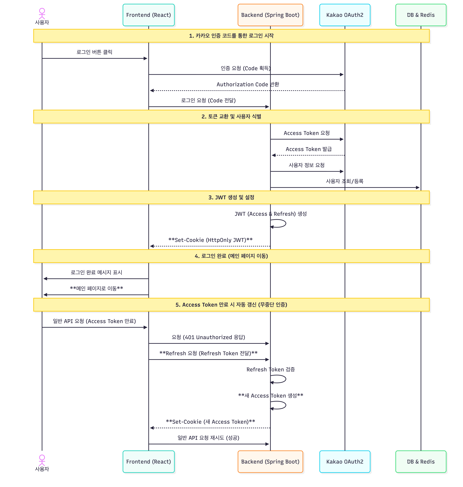
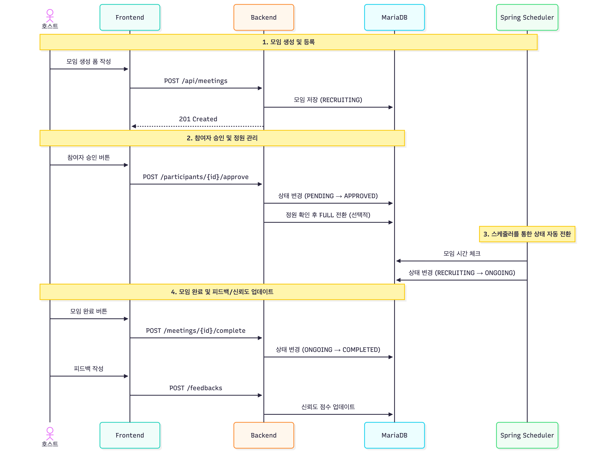
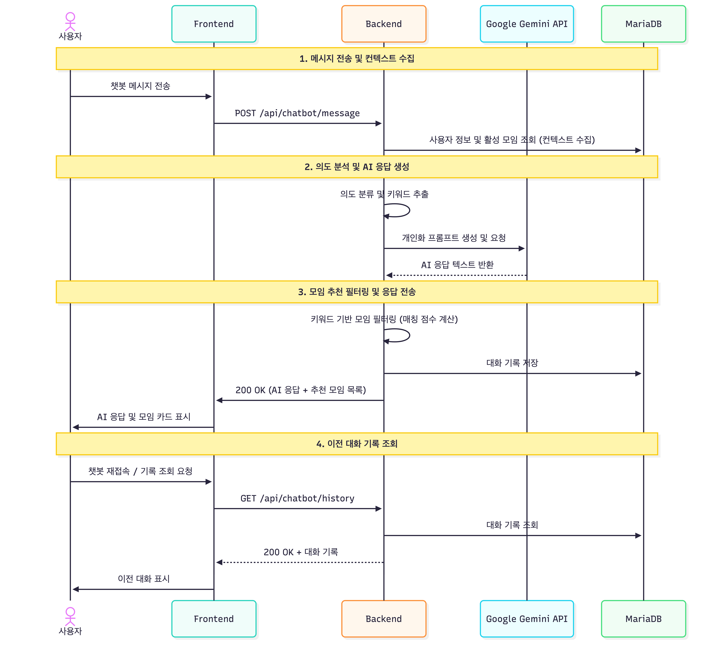

# 기능 명세서 (Feature Specification)

## 핵심 요약

**반띵**은 **Spring Boot 3.5.6 (Java 21)** 기반의 백엔드와 **React 19.1.1 + Vite 7.1.2** 기반의 프론트엔드로 구성된 풀스택 소분 플랫폼입니다. Kakao OAuth2 + JWT 인증, MariaDB, Google Gemini AI API 연동을 통해 **지도 기반 모임 탐색**과 **AI 챗봇 검색**, **피드백 기반 신뢰도 시스템**을 실현합니다.

---

## 기술 스택 (Tech Stack)

### Frontend

| 기술 (Technology) | 용도 (Usage) |
|:---|:---|
|  | UI 컴포넌트 라이브러리 |
|  | 빌드 도구 및 개발 서버 (HMR 지원) |
|  | 클라이언트 사이드 라우팅 |
|  | 경량 상태 관리 |
|  | HTTP 클라이언트 (API 통신) |
|  | CSS 전처리기 |
|  | 아이콘 라이브러리 |
|  | 코드 품질 관리 |

### Backend

| 기술 (Technology) | 용도 (Usage) |
|:---|:---|
|  | 프로그래밍 언어 |
|  | 백엔드 프레임워크 |
|  | 인증/인가 (JWT + OAuth2) |
|  | ORM (객체-관계 매핑) |
|  | 타입 안전 동적 쿼리 |
|  | 토큰 기반 인증 |
|  | 보일러플레이트 코드 자동 생성 |
|  | SQL 쿼리 로깅 |

### Database

| 기술 (Technology) | 용도 (Usage) |
|:---|:---|
|  | 운영 데이터베이스 |

### External APIs

| 기술 (Technology) | 용도 (Usage) |
|:---|:---|
|  | AI 챗봇 (모임 추천 및 자연어 검색) |
|  | 소셜 로그인 |
|  | 지도 기반 모임 탐색 |

### Infrastructure

| 기술 (Technology) | 용도 (Usage) |
| :--- | :--- |
|  | 백엔드 서버 호스팅 |
|  | MariaDB 관리형 데이터베이스 |
|  | 정적 파일 저장 (프로필 이미지 등) |
|  | 프론트엔드 CDN |
|  | 도메인 관리 |

---

## 시스템 아키텍처

---

## 핵심 기능

### 1. JWT 기반 인증 시스템 
```
카카오 소셜 로그인을 통한 간편 인증 및 JWT 토큰 자동 갱신
```

#### 인증 플로우


#### 주요 보안 특징

| 항목 | 내용 |
|-----|------|
| **HttpOnly 쿠키** | XSS 공격 방어 (JavaScript 접근 불가) |
| **SameSite=None** | CORS 환경에서 쿠키 전송 허용 |
| **Secure 플래그** | HTTPS에서만 쿠키 전송 |
| **Access Token** | 15분 만료 (단기 유효기간) |
| **Refresh Token** | 7일 만료 (자동 갱신용) |
| **JWT subject** | Kakao providerId (고유 식별자) |

---

### 2. 지도 기반 모임 탐색  
```
카카오 지도로 마트 위치를 시각화하고 마커 클릭으로 모임 조회
```

#### 탐색 플로우 비교

**기존 방식:**
```
당근마켓: 내 동네 설정 → 검색 → 동네 범위 제한
온라인 카페: 게시글 검색 → 날짜/장소 일일이 확인
```

**반띵 방식:**
```
지도 접속 → 마커 클릭 → 해당 지점 모임 리스트 즉시 확인 → 참여 신청
```

#### 구현 특징

| 항목 | 내용 |
|-----|------|
| **서울 8개 지점** | 코스트코 4곳, 트레이더스 2곳, 롯데마트 맥스 2곳 |
| **마커 클러스터링** | 가까운 마트 그룹화 표시 |
| **실시간 모임 수** | 마커에 모집 중인 모임 수 표시 |
| **지도-목록 연동** | 마커 클릭 시 하단 목록 필터링 |

---

### 3. 모임 관리 시스템
```
모임 생성부터 참여자 관리, 자동 상태 전환까지 전체 라이프사이클 관리
```

#### 모임 관리 플로우 (호스트 관점)


#### 모임 참여 플로우 (참여자 관점)


#### 모임 상태 관리

| 상태 | 설명 | 전환 조건                                     |
|-----|------|-------------------------------------------|
| **RECRUITING** | 모집 중 | 초기 생성 상태                                  |
| **FULL** | 모집 마감 | 정원 초과 or 호스트 마감                           |
| **ONGOING** | 진행 중 | 시작 시간 도래 (자동)                             |
| **COMPLETED** | 완료 | 호스트 완료 처리 (수동) or 매일 자정에 24시간 지난 모임(자동)   |
| **CANCELLED** | 취소 | 호스트 취소 (수동) or 시작 시간 도래 시 참여자 1명 이하면 (자동) |

---

### 4. AI 챗봇 기반 모임 검색
```
Google Gemini API를 활용한 자연어 대화형 모임 추천
```

#### AI 챗봇 플로우


#### AI 챗봇 특징

| 항목 | 내용 |
|-----|------|
| **의도 분류** | MEETING_SEARCH (모임 검색)<br/>SERVICE_GUIDE (서비스 안내)<br/>GENERAL (일반 대화) |
| **키워드 추출** | 장소, 상품명, 시간 등 자동 추출 |
| **개인화 응답** | 사용자 닉네임, 신뢰도 반영 |
| **폴백 로직** | API 실패 시 키워드 기반 검색 |
| **대화 기록** | 최근 10개 대화 저장 |

---

## 5. 마이페이지 (프로필 + 모임 내역 + 신뢰도)
```
프로필 조회/수정, 모임 내역 관리, 신뢰도 확인
```


#### 신뢰도 시스템

| 행동 | 점수 변화 |
|-----|---------|
| **모임 생성** | +2점 |
| **모임 참여** | +2점 |
| **노쇼** | -20점 |
| **긍정 피드백 받음** | +5점 |
| **부정 피드백 받음** | -5점 |

#### 신뢰도 등급

| 등급 | 점수 범위              | 배지 색상 |
|-----|--------------------|---------|
| **WARNING** | 0-99점              | 🔴 빨강 |
| **BASIC** | 100-499점 (300-초기값) | 🟡 노랑 |
| **GOOD** | 500점 이상            | 🟢 초록 |


---

## 기술적 의사결정

### 1. React 19 + Vite 선택 이유

| 비교 항목 | Webpack | Vite |
|---------|---------|------|
| **빌드 속도** | 느림 (20-30초) | **빠름 (1-2초)** |
| **HMR** | 2-3초 | **즉시 반영** |
| **개발 경험** | 보통 | **탁월** |

- **선택**: Vite
- **이유**: 19일 짧은 개발 기간에 빠른 피드백 필수

### 2. Zustand vs Redux
```javascript
// Redux - 보일러플레이트 多
const authSlice = createSlice({
  name: 'auth',
  initialState: { user: null },
  reducers: {
    setUser: (state, action) => { state.user = action.payload }
  }
});

// Zustand - 간결함
const useAuthStore = create((set) => ({
  user: null,
  setUser: (user) => set({ user })
}));
```

- **선택**: Zustand
- **이유**: 간단한 인증 상태 관리만 필요

### 3. MariaDB vs PostgreSQL

| 항목 | MariaDB | PostgreSQL |
|-----|---------|------------|
| **쿼리 복잡도** | 단순 CRUD 중심 | 복잡한 쿼리 강점 |
| **성능** | 가볍고 빠름 | 무겁지만 강력 |
| **호환성** | MySQL 호환 | - |

- **선택**: MariaDB
- **이유**: 복잡한 쿼리 불필요, 가벼운 성능

---

## 성능 최적화

### N+1 쿼리 문제 해결

**문제:**
```java
// 모임 10개 조회 → 1번 쿼리
List<Meeting> meetings = meetingRepository.findAll();

// 각 모임의 호스트 조회 → 10번 쿼리 (N+1)
for (Meeting m : meetings) {
    User host = m.getHost();
}
```

**해결:**
```java
// QueryDSL로 LEFT JOIN FETCH
List<Meeting> meetings = queryFactory
    .selectFrom(meeting)
    .leftJoin(meeting.host, user).fetchJoin()
    .where(meeting.status.eq(MeetingStatus.RECRUITING))
    .fetch();
```

